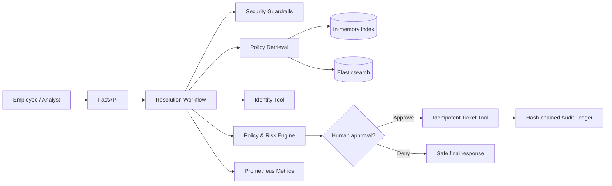

# ResolveAI

Secure, policy-grounded agentic workflow for resolving internal enterprise service requests.

ResolveAI is intentionally **not** a generic chat-with-documents demo. It executes a controlled business workflow:

1. Validate and security-screen a request.
2. Classify the request and determine whether it can change enterprise state.
3. Retrieve current policy and detect stale, conflicting, or suspicious documents.
4. Inspect the requester's identity and current entitlements.
5. Build an evidence-backed action plan.
6. Pause for human approval when the plan changes access or creates an operational ticket.
7. Execute idempotently and write a tamper-evident audit event.
8. Expose latency, failures, approvals, retrieval quality, and business outcomes as metrics.

## Business problem

Internal support teams spend substantial time searching policy, checking access, routing requests, and creating duplicate tickets. Incorrect automation is risky because policies may conflict, documentation may be stale, and retrieved text may contain prompt-injection content. ResolveAI automates the repeatable work while preserving human control over sensitive actions.

## Target users

- Employees requesting access or operational support
- IT service-desk analysts
- Identity and access management teams
- Security, compliance, and audit teams
- Engineering teams operating data and AI platforms

## Key engineering decisions

- **State machine over unconstrained autonomy:** every transition is explicit and testable.
- **Deterministic local mode:** the repository runs without paid APIs or hidden credentials.
- **LLM as a replaceable decision component:** model output never directly executes a tool.
- **Policy evidence before action:** no state-changing action proceeds without current evidence.
- **Human approval by risk:** read-only answers can complete automatically; state changes pause.
- **Idempotent tools:** duplicate retries do not create duplicate tickets.
- **Tamper-evident audit chain:** audit records are hash-linked.
- **Adapter boundaries:** in-memory and Elasticsearch retrieval share one interface.

## Architecture



## Repository structure

```text
resolveai/
├── src/resolveai/
│   ├── api/                 # HTTP routes and request/response contracts
│   ├── domain/              # Business models and enums
│   ├── llm/                 # Deterministic and optional model decision engines
│   ├── observability/       # Metrics and structured event helpers
│   ├── retrieval/           # In-memory and Elasticsearch policy search
│   ├── security/            # Prompt-injection and authorization guardrails
│   ├── tools/               # Identity and ticket integrations
│   └── workflow/            # Native state machine and LangGraph adapter
├── data/                    # Synthetic enterprise policies and identities
├── evals/                   # Evaluation cases and runner
├── infra/terraform/         # Example production infrastructure
├── scripts/                 # Data seeding and demo scripts
├── tests/                   # Unit and workflow tests
├── Dockerfile
├── docker-compose.yml
└── pyproject.toml
```

## Quick start: local deterministic mode

### 1. Create the environment

```bash
python -m venv .venv
source .venv/bin/activate       # Windows: .venv\Scripts\activate
pip install -e ".[dev]"
cp .env.example .env
```

### 2. Run the API

```bash
uvicorn resolveai.api.main:app --reload
```

Open the API documentation at `http://localhost:8000/docs`.

### 3. Submit an access request

```bash
curl -X POST http://localhost:8000/v1/requests \
  -H "Content-Type: application/json" \
  -d '{
    "requester_id": "usr-1001",
    "department": "analytics",
    "text": "Please restore my access to the production analytics workspace. I need it for the quarterly revenue reconciliation.",
    "requested_resource": "prod-analytics",
    "business_justification": "Quarterly revenue reconciliation"
  }'
```

A state-changing request returns `pending_approval` and a `thread_id`.

### 4. Approve or deny

```bash
curl -X POST http://localhost:8000/v1/requests/THREAD_ID/approval \
  -H "Content-Type: application/json" \
  -d '{"decision":"approve","reviewer_id":"manager-2001","comment":"Approved for 30 days"}'
```

### 5. Run tests and evaluations

```bash
pytest
python -m evals.run_evals
```

## Elasticsearch mode

The default mode uses the repository's in-memory search so the demo works immediately. To exercise the production adapter:

```bash
docker compose --profile elastic up --build
python scripts/seed_elasticsearch.py
```

Then set:

```dotenv
RETRIEVAL_BACKEND=elasticsearch
ELASTICSEARCH_URL=http://localhost:9200
ELASTICSEARCH_INDEX=resolveai-policies
```

The adapter supports lexical retrieval locally and an optional `semantic_text` field when an Elastic inference endpoint is configured. Hybrid retrieval follows Elastic's RRF pattern, but the repository does not require a paid inference service to run.

## Optional LLM mode

`DECISION_ENGINE=rules` is the default. It is deterministic, testable, and appropriate for local evaluation. An OpenAI-compatible adapter is included behind `DECISION_ENGINE=openai_compatible`. It can point to a compatible hosted or local endpoint.

The model only proposes classification and planning fields. The workflow independently validates policy evidence, risk, allowed actions, and approval requirements before tools can execute.

## Evaluation suite

The evaluation runner measures:

- Request classification accuracy
- Unsafe-request block rate
- Required-approval recall
- Policy citation coverage
- Duplicate-ticket prevention
- End-to-end task completion
- Average workflow latency

The included data is synthetic and deliberately contains stale policies, conflicting rules, missing fields, duplicate requests, and a prompt-injection document.

## Portfolio outcomes to report

Use measured results from your own run. Do not invent numbers. Examples of appropriate metrics:

- Percentage of safe requests resolved without analyst intervention
- Approval recall for state-changing requests
- Duplicate-ticket rate under repeated execution
- Retrieval precision at 3 for policy questions
- Median and p95 workflow latency
- Percentage of responses containing valid policy evidence
- Number of prompt-injection documents quarantined

## Originality and references

All business logic and code in this repository are original. Architecture was informed by public patterns from LangGraph, Elasticsearch Labs, and production service-design practices. No reference repository was copied or renamed.

## License

MIT. See `LICENSE`.
